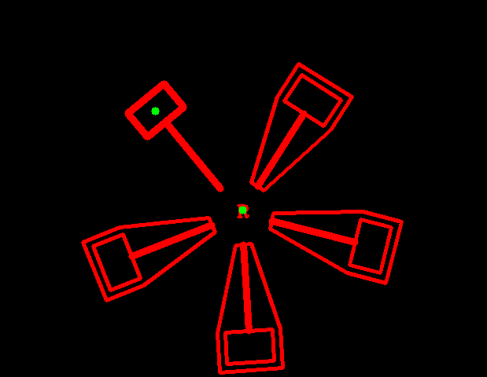

# 绘制圆圈
## 根据识别轮廓面积大小确定R和锤头后，圆圈总位于锤头偏下的部位，运用向量扩大倍数解决。
# 安装ceres库
## 1.4.0不能正常安装，安装的2.2.0,已拍视频。
# 计时
## 计时开始结束放置的位置有问题，终端不能输出时间。
## 没有注意到需要按其他建才能进行下一步。
## 一直不能正常收敛，导致不能输出时间。
## omega的值一直不变，不知道原因。
### 重新检查残差结构体和损失函数，找到初始化时刻的问题，时间戳太大，角速度计算逻辑也有问题。

